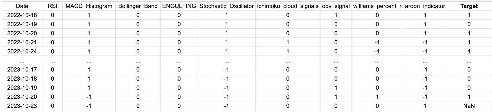

# Machine Learning on Technical Analysis Indicators
This project was created by @thomas211738 and @joshleeds

## Overview
We wanted to see if technical analysis indicators were good predictors of a stock's future directionality. Since there are many technical analysis indicators, we decided to use as many as possible and apply them as features to a machine learning model to identify the best combination of technical analysis indicators that result in the best results. We did this for about 250 stocks to test how well the models worked for different stocks and avoid overfitting our 

## Technical Analysis Indicators
For this project, we used the following technical analysis indicators as features:

1. Simple Moving Average (SMA)
2. Exponential Moving Average (EMA)
3. Relative Strength Index (RSI)
4. Moving Average Convergence Divergence (MACD)
5. Bollinger Bands
6. Stochastic Oscillator
7. Ichimoku Cloud Signals
8. Aroon Indicator
9. Williams %R
10. On-Balance-Volume (OBV)

## Machine Learning Model
For the machine learning model, we used an LSTM neural network using keras in tensor flow. We trained 250 different models for the 250 companies that we chose. We first acquired 20 years worth of stock data for each company and split it with 80% (16y) of the data to be trained on, and 20% (4y) of the data to be tested on. We also wanted to use the past 100 days of the or our training data set, our x values were 

